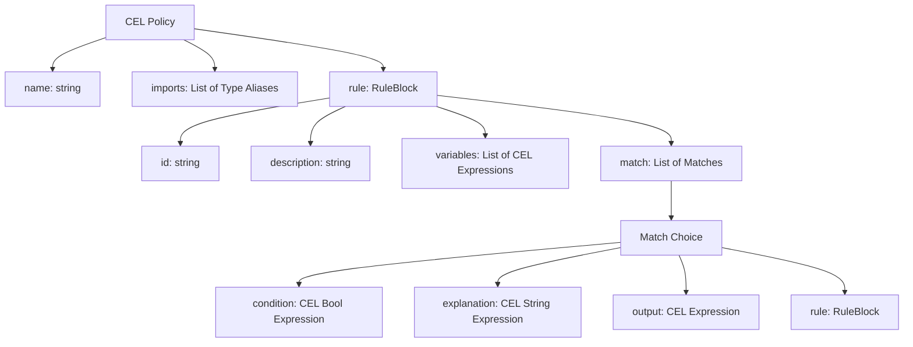

# Common Expression Language (CEL) Policy

The **Common Expression Language (CEL) Policy** framework is a high-performance, strongly-typed, and deterministic policy language standard built on top of the [Common Expression Language](https://github.com/google/cel-spec).

This repository contains the **conformance test suite** for CEL Policies, designed to ensure consistent and correct behavior across various language implementations (such as Go, C++, and Java).

---

## Overview

CEL is widely used for isolated, safe expression evaluation. However, complex logical flows (such as Kubernetes admission control, security filters, and cloud access policies) often require structure beyond simple standalone expressions:
* Scoped variable declaration and binding.
* Branching logic and decision-making trees.
* Consistent outcome types with contextual explanations.

CEL Policy addresses these needs by providing a structured, declarative format (written in YAML) that supports scoped execution, lazy variable evaluation, top-down matching, and rule nesting.



---

## Key Features

* **Safety and Termination Guarantees**: Like base CEL, policies are side-effect-free and non-Turing complete. They are mathematically guaranteed to terminate rapidly, making them ideal for latency-critical, high-throughput systems.
* **Lazy Scoped Variables**: Local variables are defined using CEL expressions and are evaluated on-demand (lazily) and memoized (cached) to prevent redundant computation.
* **Flexible Evaluation Semantics**: Currently, rules are evaluated in a strict top-down `FIRST_MATCH` sequence (the first condition to evaluate to `true` determines the outcome, eliminating backtracking). The specification is designed to extend to other evaluation modes in the future, such as `LAST_MATCH`, `ALL_MATCH`, and `AGGREGATE` policies.
* **Strong Composition and Type Checking**: The policy compiler statically validates that all possible output paths evaluate to the **exact same type**, avoiding dynamic runtime type mismatches.
* **Structured Defaults and Optionals**: If no match conditions are met, policies cleanly return `optional.none()`, allowing callers to seamlessly handle unmatched states.

---

## Policy Language & Syntax

A policy is a named instance of a rule which consists of a set of conditional outputs and conditional sub-rules. Matches within the rule and subrules are combined and ordered according to the policy evaluation semantic.

### Top-Level Fields

A policy source document supports the following top-level keys:

- `name` *(string, required)*: A system-specific unique identifier for the policy.
- `description` *(string, optional)*: A human-readable description of what the policy does.
- `imports` *(list[object], optional)*: A list of type name aliases to simplify object and protobuf references within the expressions.
- `rule` *(object, required)*: The entry point for the policy execution.

---

### Rule Block (`rule`)

The `rule` node in a policy is the primary entry point to CEL computations. Fields above the `rule` (like `imports`) are intended to simplify or support the CEL expressions within the `rule` block.

A `rule` block supports the following fields:
- `id` *(string, optional)*: A unique identifier for the rule.
- `description` *(string, optional)*: A user-friendly description of the rule.
- `variables` *(list, optional)*: Ordered local variable declarations.
- `match` *(list, required)*: The sequential choices to evaluate.

---

### Local Variables (`variables`)

Variables are defined as an ordered list. A variable has a `name` and an `expression` defined by a CEL expression. 

```yaml
variables:
  - name: first_item
    expression: "1"
  - name: list_of_items
    expression: "[variables.first_item, 2, 3, 4]"
```

> [!IMPORTANT]
> Variables may refer to other variables in the same block, but a variable must be defined *before* it is referenced (no forward or self-references are allowed).

#### Evaluation Behavior
Variables in CEL Policy are **lazily evaluated** and **memoized** (cached). Because CEL is strictly side-effect free, only the variables accessed during a matching condition or output evaluation are ever computed. Using a variable is equivalent to using the `cel.bind()` macro to introduce local computations within a CEL expression.

---

### Match Choices (`match`)

A `match` block contains a sequence of conditional logic and outcomes evaluated in a top-down, first-match sequence. A match block must contain at least one output path.

Each match item contains:
- `condition` *(string, optional)*: A CEL expression evaluating to `bool`. If omitted, it defaults to `true` (acting as a default/fallback outcome).
- `explanation` *(string, optional)*: A CEL expression evaluating to a `string` that describes the context or reason for this match.
- **Outcome**: Each match item must define exactly one of:
  * `output` *(string)*: A CEL expression defining the final return value of the policy if matched.
  * `rule` *(object)*: A nested `rule` block to evaluate further if matched.

---

### Conditions and Return Types

A `condition` expression must type-check to a `bool` return type. When a `condition` predicate evaluates to `true`, either the corresponding `output` expression is evaluated and returned, or the nested `rule` block is evaluated.

#### Optional Return Types
The overall return type of a policy is dynamically determined by its evaluation completeness:
- **Exhaustive/Unconditional Return**: If the policy guarantees that a match path is always met (e.g., the final match has no `condition` or is `condition: "true"`), the return type of the policy is the plain type `T` of its outputs.
- **Conditional Return**: If all `output` expressions within a `rule` have associated `condition` predicates, some evaluation paths may not yield a match. In this case, the return type of the policy is wrapped in an optional: `optional_type(T)` (e.g., `optional_type(string)`). If no evaluation paths result in a matched output, `optional.none()` is returned as the overall policy result.

For more details on CEL optionals, refer to the [CEL optional proposal](https://github.com/google/cel-spec/wiki/proposal-246).

---

### Type Imports (`imports`)

The top-level `imports` list defines type alias references. These aliases simplify writing type names in your CEL expressions, making object construction or protobuf message typing much cleaner:

```yaml
name: pb_policy
imports:
  - name: cel.expr.conformance.proto3.TestAllTypes
  - name: cel.expr.conformance.proto3.TestAllTypes.NestedEnum
```

By importing these types, you can refer to them by their simple names inside the rules:
* Instantiate messages directly: `TestAllTypes{single_int64: 10}`.
* Refer to enums directly: `NestedEnum.BAR`.

---

### Non-standard YAML Behaviors

To ensure precise source-position reporting and error diagnostics, conforming CEL Policy compilers preserve multiline expression formatting. 

When writing multi-line expressions in YAML using block scalars (e.g. using `>` or `|`), compilers must preserve the original line offsets and leading spacing. This allows runtime errors or type-checking errors to highlight the exact line and column location of the invalid CEL expression relative to the original policy document.

---

## Complete Example

The following policy demonstrates variable binding, nested rules, and fallback outputs. It validates access control constraints on resource requests:

```yaml
name: access_control
rule:
  variables:
    - name: is_admin
      expression: "request.auth.claims.role == 'admin'"
    - name: resource_tags
      expression: "request.resource.tags"
  match:
    # Admins are immediately permitted
    - condition: "variables.is_admin"
      output: "'ALLOW'"

    # If resource contains sensitive tags, check specific authorization
    - condition: "'pii' in variables.resource_tags"
      rule:
        id: "pii_access_rule"
        description: "Ensure only authorized users can access PII resources"
        match:
          - condition: "'privacy-team' in request.auth.claims.groups"
            output: "'ALLOW'"
          - output: "'DENY'"
            explanation: "'User ' + request.auth.claims.email + ' lacks privacy group authorization for PII access'"

    # Default policy outcome
    - output: "'ALLOW'"
```

---

## Conformance Test Suite

To guarantee consistent policy evaluation across languages (Go, C++, Java), this repository houses a comprehensive conformance test suite.

### Test Anatomy
Each test category includes three key components:

| File Name | Format | Purpose |
| :--- | :--- | :--- |
| `config.yaml` / `config.textproto` | YAML or Protobuf | Configures the CEL environment, declares input variables (`variables`), specifies types, and registers stdlib extensions (like `strings`). See [context_pb/config.textproto](conformance/testdata/context_pb/config.textproto). |
| `policy.yaml` | YAML | The actual CEL policy file being tested. See [nested_rule/policy.yaml](conformance/testdata/nested_rule/policy.yaml). |
| `tests.yaml` / `tests.textproto` | YAML or Protobuf | Test cases containing input values (`input`) and the expected evaluation outcomes (`output`), or expected compilation error sets. See [nested_rule/tests.yaml](conformance/testdata/nested_rule/tests.yaml). |

---

## Static Analysis & Compilation Guarantees

Conforming CEL Policy compilers must implement strict compile-time static analysis. To verify this, the test suite in [compile_errors/](conformance/testdata/compile_errors) defines negative test cases that must fail compilation with appropriate error sets.

The suite covers the following compile-time checks:

1. **Type Agreement (Incompatible Outputs)**: The compiler must statically verify that all possible match branches in a policy evaluate to the **exact same type**. Mixing outcome types (e.g., one branch returning `bool` and another returning `map`) is a compile-time error. See [compile_errors/compose_conflicting_output/policy.yaml](conformance/testdata/compile_errors/compose_conflicting_output/policy.yaml).
2. **Unreachable Code (Dead Condition Detection)**: The compiler must detect and reject policies with dead-code branches. For example, if an unconditional match choice (one without a `condition` or where `condition: "true"`) precedes other choices in a block, subsequent choices are unreachable and will trigger a compilation failure. See [compile_errors/unreachable/policy.yaml](conformance/testdata/compile_errors/unreachable/policy.yaml).
3. **Scope and Reference Validation**: The compiler must validate that all referenced variables, inputs, and imported Protobuf types are properly declared in the scope. It also ensures variable names are unique (no duplicates) and prevents forward or self-referential variable dependencies. See [compile_errors/undeclared_reference/policy.yaml](conformance/testdata/compile_errors/undeclared_reference/policy.yaml) and [compile_errors/duplicate_variable/policy.yaml](conformance/testdata/compile_errors/duplicate_variable/policy.yaml).

---

## How to Use This Suite

If you are implementing a CEL Policy compiler or engine in your language of choice, you can import this repository using Bazel and execute your runner against these standardized tests.

### Incorporating in Bazel

Add this repository to your `MODULE.bazel`:

```bazel
bazel_dep(name = "cel_policy", version = "0.1.0")
```

In your test target, depend on the conformance test data filegroup:

```bazel
test_suite(
    name = "conformance_tests",
    tests = [
        # Reference the conformance files in your runner
        "@cel_policy//conformance:testdata",
    ],
)
```

---

## License

CEL Policy is licensed under the [Apache License 2.0](LICENSE).
